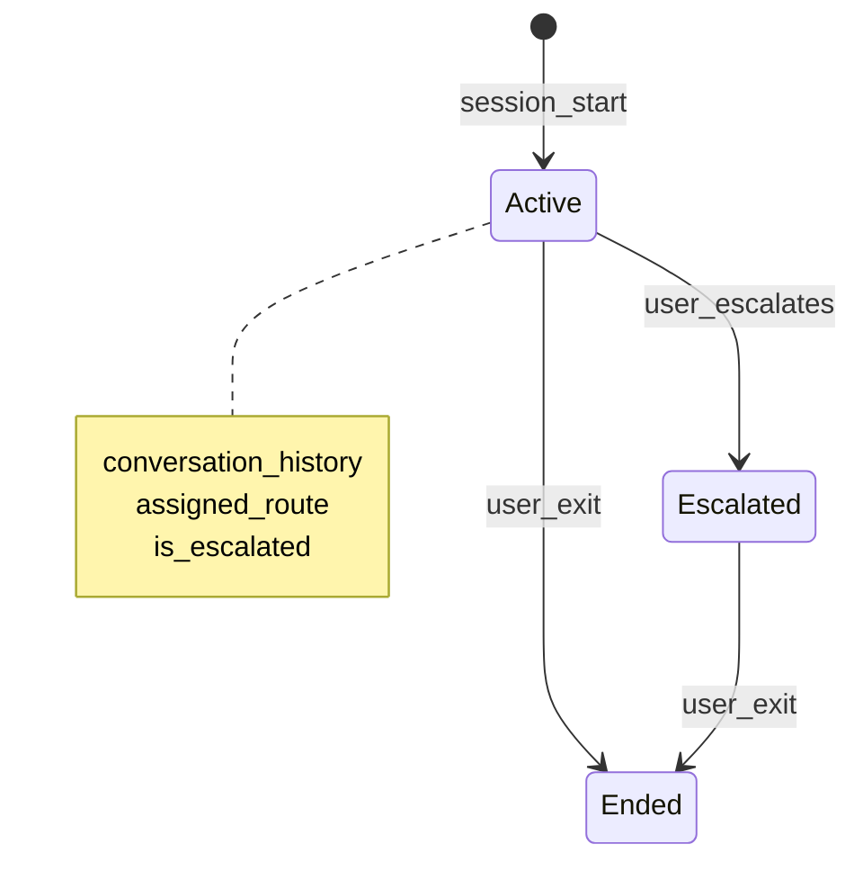
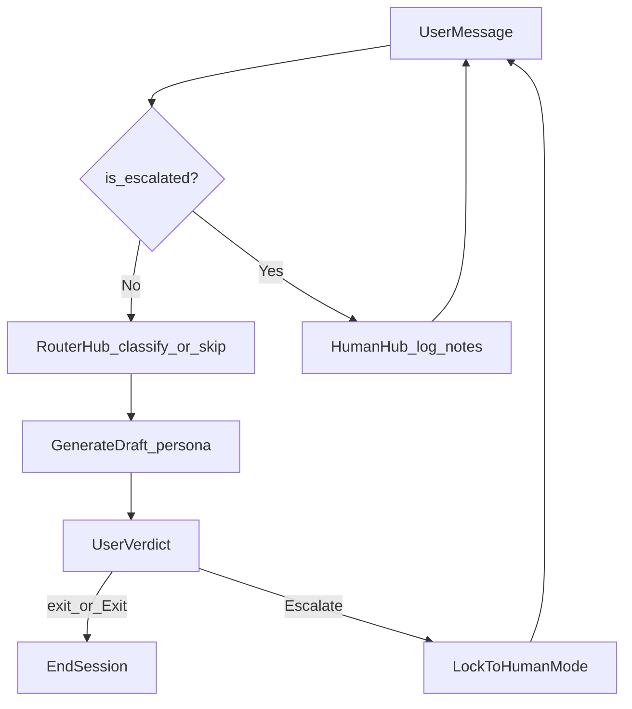

# Agentic AI Workflow — Requirements

## 1. Purpose and scope

This document specifies behavioral requirements for a **multi-turn conversational support agent** operated under a **Tier 1 (Native Python Code)** execution model: orchestration, branching, and session state are implemented in Python; large language models (LLMs) are invoked as discrete steps within that control flow. No external workflow engine is required.

**In scope:** session state, per-turn lifecycle, routing policy, escalation lockout, termination, and user-facing copy for defined states.

**Out of scope for this document:** ticketing dashboard integration, transcript file formats, exact UI framework, Triage Payload JSON schema, and persona prompt bodies. See [§9 Non-goals](#9-non-goals).

---

## 2. Execution model

- **REQ-EXEC-01:** The system MUST process one user turn at a time, sequentially, within a single active session.
- **REQ-EXEC-02:** LLM invocations (Triage Hub, Persona) MUST be invoked only through native Python control flow (e.g., conditionals, branches)—not through a separate workflow DSL or graph runtime.
- **REQ-EXEC-03:** On any turn where Phase A exits early (termination or Human Lockout), the system MUST NOT invoke any LLM for that turn.

---

## 3. Session state

Every active user session MUST maintain exactly three in-memory state variables.

| Variable | Type | Initial value | Description |
|----------|------|---------------|-------------|
| `conversation_history` | List of messages | Empty | Alternating user and model messages, structured for direct use with the Gemini API. |
| `assigned_route` | Enum or `None` | `None` | Support route; see [§5 Routing policy](#5-routing-policy). |
| `is_escalated` | Boolean | `False` | When `True`, the session is in **Human Lockout** (see Glossary). |

- **REQ-STATE-01:** `conversation_history` MUST append the user message and model reply only after a successful Phase C generation on that turn.
- **REQ-STATE-02:** `assigned_route` MUST remain `None` until Triage Hub returns a valid route (see REQ-ROUTE-03). Once set to a valid route, it MUST NOT change for the remainder of the session.
- **REQ-STATE-03:** Valid route values are exactly: `billing`, `tech`, `feature`, `misc`.
- **REQ-STATE-04:** `is_escalated` MUST default to `False` at session start and MUST flip to `True` only when the user triggers the Human escape hatch (see REQ-ESC-01).

### Session state diagram

---

## 4. Per-turn lifecycle

Each user submission MUST be handled in order through **Phase A → Phase B → Phase C → Phase D**, unless an early exit applies. Phases B–D run only when Phase A does not terminate the session or enter Human Lockout.

### Phase A — Interception and input validation

Phase A MUST run first on every turn.

#### Termination

- **REQ-TERM-01:** If the raw user input is exactly `exit` or `Exit`, the system MUST run a cleanup function (persist the text transcript to a local file **or** print a summary—either satisfies this requirement), then MUST end the session.
- **REQ-TERM-02:** On termination, the system MUST NOT invoke any LLM.
- **REQ-TERM-03:** Termination via `exit` / `Exit` MUST be available regardless of `is_escalated` (including during Human Lockout).

#### Human Lockout

- **REQ-LOCK-01:** If `is_escalated == True`, the system MUST bypass all LLM nodes for that turn.
- **REQ-LOCK-02:** The system MUST append the user message to a human-operator notepad (in-session collection of notes).
- **REQ-LOCK-03:** The system MUST respond with exactly:  
  `Your session is currently queued for a human support representative. Notes added.`

### Phase B — Contextual routing

Phase B runs only if the turn was not terminated in Phase A and `is_escalated == False`.

#### First turn (route not yet assigned)

- **REQ-ROUTE-01:** If `assigned_route` is `None`, the system MUST send the raw user text to the **Triage Hub** with model `gemini-2.5-flash-lite`, temperature `0.0`, and strict JSON output.
- **REQ-ROUTE-02:** On successful validation of the Triage Hub response against the route enum (§3), the system MUST set `assigned_route` permanently for the session.
- **REQ-ROUTE-03:** If Triage Hub returns invalid JSON or a route value outside `billing` | `tech` | `feature` | `misc`, the system MUST NOT set `assigned_route`, MUST NOT proceed to Phase C on that turn, MUST display a user-facing error, and MUST prompt the user to rephrase.

#### Subsequent turns (sticky context)

- **REQ-ROUTE-04:** If `assigned_route` is already set, the system MUST NOT re-invoke Triage Hub; it MUST use the established route for Phase C.

### Phase C — Best-guess generation

Phase C runs only after Phase B assigns or reuses a valid `assigned_route`.

- **REQ-GEN-01:** The system MUST select the domain-specific system instruction by `assigned_route` using native branching (e.g., `switch` / `if-else`). Named instruction references include `BILLING_PROMPT`, `TECH_BUG_PROMPT`, and analogous prompts for `feature` and `misc` routes.
- **REQ-GEN-02:** The **Persona** model MUST receive the full `conversation_history` plus the selected system instruction.
- **REQ-GEN-03:** Persona generation MUST use temperature `0.7`.
- **REQ-GEN-04:** The Persona MUST produce a natural, eloquent response and MUST make its best effort when the user’s follow-up drifts slightly outside the core domain, rather than refusing or deferring without an attempt to help.
- **REQ-GEN-05:** The system MUST display the model output to the user and MUST append the user message and model reply to `conversation_history`.

### Phase D — Interactive human escape hatch

After each successful Phase C response, the user interface MUST expose escalation.

- **REQ-ESC-01:** The UI MUST offer a way to **Escalate to a Human Specialist** (e.g., interactive button or clear text instruction).
- **REQ-ESC-02:** When the user triggers escalation, the system MUST set `is_escalated = True` immediately.
- **REQ-ESC-03:** A background process MUST create a standardized **Triage Payload** (JSON) containing at minimum: the route used (`assigned_route`), the number of conversational turns, and the complete textual conversation history, suitable for ingestion by a human ticketing dashboard.
- **REQ-ESC-04:** After escalation, further user messages MUST be handled per REQ-LOCK-01 through REQ-LOCK-03 only; Phase B and Phase C MUST NOT run until a new session begins.

---

## 5. Routing policy

The system MUST use **sticky context routing**.

| Approach | Status |
|----------|--------|
| **Sticky context routing** | **Required.** Once `assigned_route` is set on the first successful triage, all follow-up turns use that route until session end, escalation, or exit. |
| **Dynamic re-routing** | **Not used.** Re-classifying intent on every turn is explicitly out of scope to avoid mid-conversation route changes (e.g., `tech` → `billing`). |

- **REQ-POLICY-01:** Sticky context routing MUST be used for all multi-turn sessions after the first successful route assignment.

---

## 6. Session flow (end-to-end)

The following flow applies across a single session. Step 1 corresponds to Phase A lockout check; Steps 2–4 map to Phases B–C; Step 5 covers exit and escalation.

| Step | Name | Behavior |
|------|------|----------|
| 1 | Session locked? | If `is_escalated`, go to Human Hub (notes only); else continue. |
| 2 | Router Hub | Classify on first successful triage; otherwise maintain `assigned_route`. |
| 3 | Human Hub | Bypass AI; append to notepad; fixed lockout message. |
| 4 | Generate draft | Persona responds using sticky route and full history. |
| 5 | User verdict | User types `exit` / `Exit` to end session, continues chatting, or escalates to Human Lockout. |

- **REQ-FLOW-01:** There is no separate “satisfied” or “resolved” UI action; ending a session MUST occur only via `exit` / `Exit` per REQ-TERM-01.

---

## 7. Turn examples

### Turn 1 — Initial inquiry

1. User submits a problem (e.g., a technical issue).
2. `assigned_route` is `None` → Triage Hub classifies (e.g., `tech`).
3. Persona for `tech` generates the first response; history is updated.
4. UI shows **Escalate to a Human Specialist**.

### Turn 2 — Follow-up / refining

1. User follow-up (e.g., “That didn’t work, I don’t see that button.”).
2. `assigned_route` is already `tech` → Triage Hub is **not** invoked.
3. Same `tech` Persona generates using full `conversation_history`.
4. Escalation affordance remains available.

### Triage failure (before route assignment)

1. User’s first message returns invalid triage output.
2. `assigned_route` remains `None`; user sees error and rephrase prompt; no Persona response on that turn.
3. User rephrases → Triage Hub runs again until a valid route is assigned.

### Escalation mid-session

1. User triggers **Escalate to a Human Specialist**.
2. `is_escalated` becomes `True`; Triage Payload is created in the background with frozen history and metadata.
3. Further user text is stored as operator notes only; lockout message is returned; no AI generation.

### Session end

1. User types `exit` or `Exit`.
2. Cleanup runs (file or summary); session ends.

---

## 8. User-facing behaviors

| Situation | Required behavior |
|-----------|-------------------|
| Human Lockout | Exact message per REQ-LOCK-03. |
| Session end | Only `exit` / `Exit`; cleanup then terminate. |
| Triage failure | Error message + prompt to rephrase; no route assigned. |
| Escalation affordance | Label or equivalent: **Escalate to a Human Specialist**. |

---

## 9. Non-goals

The following are intentionally unspecified in this document and may be decided during implementation:

- Ticketing dashboard APIs and Triage Payload field-level schema
- Transcript file path, naming, and encoding
- Persona model identifier (if different from Triage Hub)
- Persistence of human-operator notepad beyond the active process
- Concrete UI framework (CLI, web, etc.) beyond behavioral requirements above

---

## Glossary

| Term | Definition |
|------|------------|
| **Triage Hub** | First-turn classifier using `gemini-2.5-flash-lite` at temperature `0.0` with strict JSON output to assign `assigned_route`. |
| **Persona** | Domain-specific responder selected by `assigned_route`, using route-specific system instructions at temperature `0.7`. |
| **Triage Payload** | Standardized JSON snapshot created on escalation (route, turn count, full conversation text) for human operators. |
| **Human Lockout** | Session mode when `is_escalated == True`: all LLM steps skipped; user input appended as operator notes. |
| **Sticky context** | Routing policy that locks `assigned_route` after first successful triage for the rest of the session. |

---

## Requirement index

| ID | Summary |
|----|---------|
| REQ-EXEC-01–03 | Sequential turns; Python orchestration; no LLM on early exit |
| REQ-STATE-01–04 | History, route enum, immutability, escalation flag |
| REQ-TERM-01–03 | `exit` / `Exit` cleanup and end |
| REQ-LOCK-01–03 | Human Lockout bypass and message |
| REQ-ROUTE-01–04 | Triage Hub, failure handling, sticky bypass |
| REQ-GEN-01–05 | Persona branch, temperature, best-guess, history append |
| REQ-ESC-01–04 | Escape hatch, payload, post-escalation behavior |
| REQ-POLICY-01 | Sticky context required |
| REQ-FLOW-01 | No separate “satisfied” end action |
